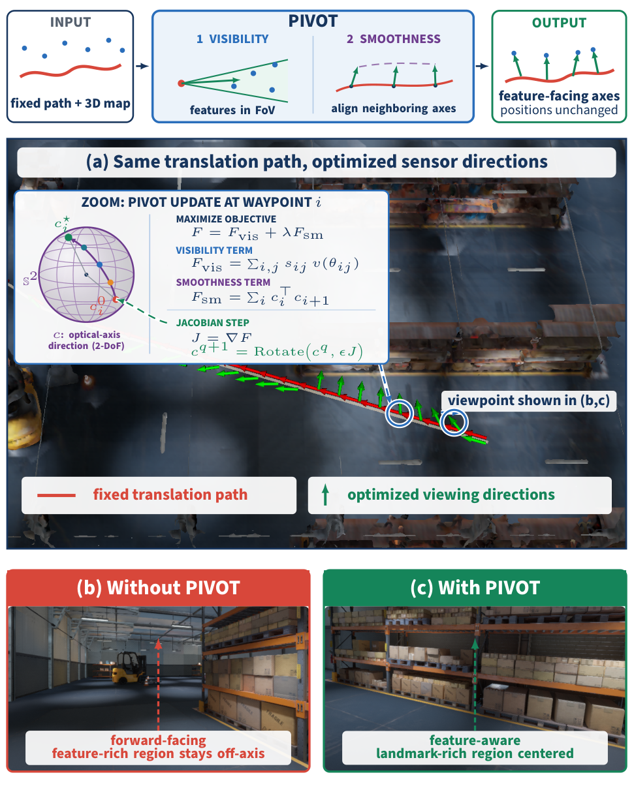
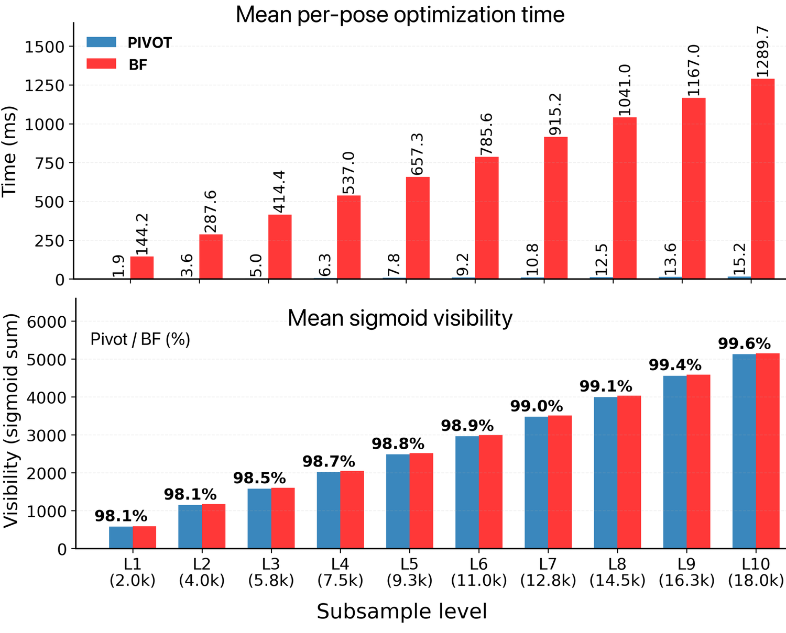
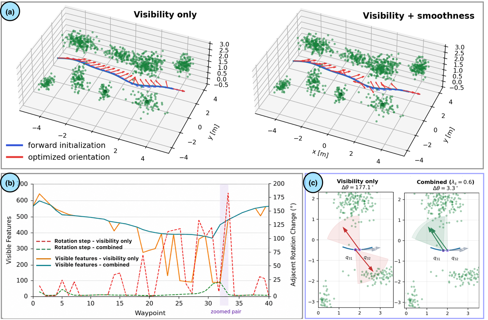
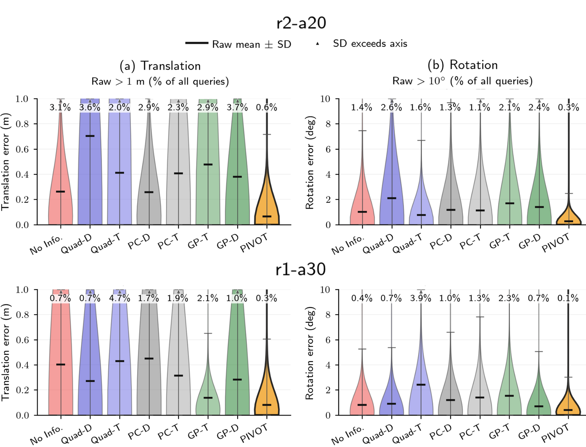
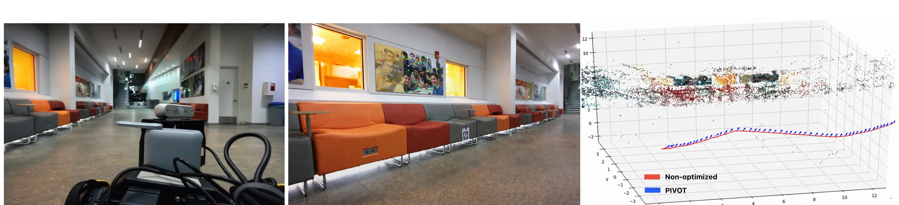

# PIVOT: Perception-aware Independent Viewpoint Online Optimization

[](https://droneslab.github.io/PIVOT/)
[](https://arxiv.org/abs/2609.19510)
[](https://youtu.be/IWPBh4lygTE)

[**Yuyang Chen\***](https://droneslab.github.io/people/yuyang/), [**Shekoufeh Sadeghi\***](https://scholar.google.com/citations?user=NCCK7doAAAAJ&hl=en), [Charuvahan Adhivarahan](https://charuvahan.com/), Elton Lemos, Chen Wang, Sanjeev J. Koppal, and [Karthik Dantu](https://dkkarthik.github.io/)  
\*Equal contribution  
*Preprint. Submitted to IEEE Robotics and Automation Letters (RA-L).*

PIVOT is a lightweight online method for controlling the viewing direction of **motion-decoupled sensors** such as gimbal-mounted cameras and steerable depth sensors. Given a fixed robot translation trajectory and a 3D landmark map, PIVOT optimizes only the sensor orientation so that task-relevant features remain inside the limited field of view (FoV).

Under a conical FoV model, visibility depends only on the optical axis, giving a two-degree-of-freedom optimization on the viewing sphere **S²**. PIVOT uses a smooth feature-visibility objective and coordinate-free **SO(3) exponential-map updates**, avoiding explicit yaw/pitch parameterizations and exhaustive viewing-sphere search. A trajectory-level smoothness term encourages continuous sensor pointing and temporal view overlap.

<p align="center">
  
</p>

## Overview

<p align="center">
  
</p>

PIVOT takes a **fixed translation path + 3D landmark map** as input and returns feature-facing sensor directions while leaving robot positions unchanged. At each waypoint it maximizes a differentiable feature-visibility objective; at trajectory level it additionally encourages neighboring optical axes to align:

> **Objective:** feature visibility + λ × viewpoint smoothness  
> **Optimize:** sensor orientation  
> **Keep fixed:** robot translation trajectory

## Contributions

- **Decoupled active FoV control.** Formulates sensor pointing for motion-decoupled cameras as an online optimization problem on S², separate from translation planning.
- **Continuous on-manifold optimization.** Derives a smooth feature-visibility objective and uses SO(3) exponential-map updates without explicit angular parameterization or exhaustive candidate-view search.
- **Trajectory-level smoothness.** Extends single-pose optimization with a smoothness objective that encourages continuous pointing and temporal view overlap.
- **Simulation and real-world validation.** Evaluates visibility, computation time, downstream visual localization, and physical viewpoint control on a Boston Dynamics Spot quadruped.

## Results

### Visibility optimization vs. brute force

The Monte Carlo evaluation uses nine truncated Gaussian clusters of 2000 features each, 400 evaluation poses, ten deterministic nested feature sets from approximately 2k to 18k features, a 30° full FoV, and a 2° brute-force viewing-sphere reference.

<p align="center">
  
</p>

| Metric | PIVOT |
|---|---:|
| Retained brute-force visibility | **98.1-99.6%** |
| Speedup over 2° brute force | **76-85×** |
| Mean per-pose runtime | **1.9-15.2 ms** |
| Brute-force runtime | 144.2-1289.7 ms |

### Trajectory smoothness

<p align="center">
  
</p>

Visibility-only optimization can abruptly switch between competing feature clusters. With the combined visibility + smoothness objective, the highlighted adjacent-view change is reduced from **177.1° to 3.3°** while largely preserving the visibility profile.

### Visual localization in photorealistic simulation

The visual-localization evaluation uses the same NVIDIA Isaac / Unreal Engine simulation setting as the Fisher Information Field baseline. Two SfM landmark maps are used: **r1-a30** (1445 SIFT features, 30° FoV half-angle) and **r2-a20** (3470 SIFT features, 20° FoV half-angle).

<p align="center">
  
</p>

| Map | PIVOT registration failure | Next-best evaluated baseline | PIVOT total computation |
|---|---:|---:|---:|
| r1-a30 | **29.6%** | 41.0% | **0.045 s** |
| r2-a20 | **2.4%** | 4.4% | **0.061 s** |

PIVOT is compared against the six perception-aware baselines from Fisher Information Field — **PC-D, PC-T, GP-D, GP-T, Quad-D, and Quad-T** — together with a no-information baseline. The paper reports the lowest mean translation and rotation errors for PIVOT on both maps and the lowest registration-failure rates among the evaluated methods.

### Real-world Spot experiment

<p align="center">
  
</p>

The physical platform consists of a **Boston Dynamics Spot**, a ROS-based **iQuotient Robotics pan-tilt gimbal**, an **Intel RealSense D455**, and a **Velodyne VLP-16** with FAST-LIO localization. Spot follows the same nominal S-shaped Autowalk route under two sensing conditions.

| Condition | Successful registrations | Success rate |
|---|---:|---:|
| **PIVOT** | **416 / 420** | **99.0%** |
| Forward-facing | 296 / 420 | 70.5% |

This corresponds to a **28.6 percentage-point increase** in COLMAP registration success for the evaluated indoor route.

The outdoor demonstration additionally uses standing people as task-relevant 3D regions of interest and tracks the resulting PIVOT viewing-direction trajectory while Spot moves through the environment.

## Baseline Code

The modified Fisher Information Field code used for the baseline experiments is maintained separately so the upstream baseline lineage remains clear:

- **FIF baseline fork:** https://github.com/cikufa/my_FIF-perception-aware-planning

## Repository Layout

The repository contains the C++ on-manifold optimizer, trajectory optimization, Monte Carlo evaluation scripts, visual-localization evaluation, mapping/registration utilities, and robot-side integration code.

Key locations currently include:

```text
Manifold_cpp/        Core C++ optimizer and trajectory optimization
scripts/             Monte Carlo generation/evaluation/plotting utilities
Map/                 Map-related inputs and utilities
Detection/           Detection-related components
catkin_ws/           ROS integration
unrealcv_bridge/     UnrealCV bridge code
```

## Reproducing the Experiments

The paper timing experiments were run on an **Intel Core i9-14900K CPU**, using **single-threaded C++14** implementations under **Ubuntu 22.04**. The public repository already contains the experiment scripts and implementation notes, but the dependency versions and released experiment assets still need to be consolidated into one reproducible setup.

### Clone

```bash
git clone https://github.com/droneslab/PIVOT.git
cd PIVOT
```

### Core optimizer

The core C++ implementation lives under `Manifold_cpp/` and uses CMake. The repository currently detects Eigen and optionally voxblox.

```bash
cd Manifold_cpp
mkdir -p build && cd build
cmake ..
make -j
```

> **TODO:** add the exact compiler/CMake/dependency versions used for the release and remove any machine-specific paths from the build configuration.

### Monte Carlo evaluation

The repository provides:

- `scripts/generate_cluster_map.py` — generate clustered synthetic maps and nested feature subsets.
- `scripts/run_monte_carlo_experiment.py` — run PIVOT and brute-force evaluations.
- `scripts/plot_monte_carlo_results.py` — generate runtime, visibility, and spatial-comparison plots.

> **TODO:** add the exact released command/config matching the paper's nine-cluster, 400-pose, 2k-18k-feature experiment.

### Photorealistic localization evaluation

The paper uses an NVIDIA Isaac / Unreal Engine simulator, COLMAP-based sparse SfM maps, and a prebuilt occlusion depth map. PIVOT optimizes sensor orientation along a collision-free translation path and registers rendered query images against the same reference maps used by the baselines.

> **TODO:** document simulator versions/assets, COLMAP setup, the released `r1-a30` and `r2-a20` maps, and the exact baseline/PIVOT evaluation commands.

### Real-world pipeline

The paper's physical system uses Spot + pan-tilt gimbal + RealSense D455 + VLP-16/FAST-LIO. The repository contains mapping, planning, localization, registration, and ROS-side utilities.

> **TODO:** document the exact ROS/FAST-LIO/gimbal versions, launch files, topic names, calibration assumptions, and the released mapping/Autowalk data needed to reproduce the reported 420-frame comparison.

## Citation

```bibtex
@misc{chen2026pivot,
  title         = {PIVOT: Perception-aware Independent Viewpoint Online Optimization},
  author        = {Yuyang Chen and Shekoufeh Sadeghi and Charuvahan Adhivarahan and Elton Lemos and Chen Wang and Sanjeev J. Koppal and Karthik Dantu},
  year          = {2026},
  eprint        = {2609.19510},
  archivePrefix = {arXiv},
  primaryClass  = {cs.RO}
}
```

## Links

- **Project page:** https://droneslab.github.io/PIVOT/
- **Paper:** https://arxiv.org/abs/2609.19510
- **Code:** https://github.com/droneslab/PIVOT
- **Video:** https://youtu.be/IWPBh4lygTE
- **FIF baseline code:** https://github.com/cikufa/my_FIF-perception-aware-planning
