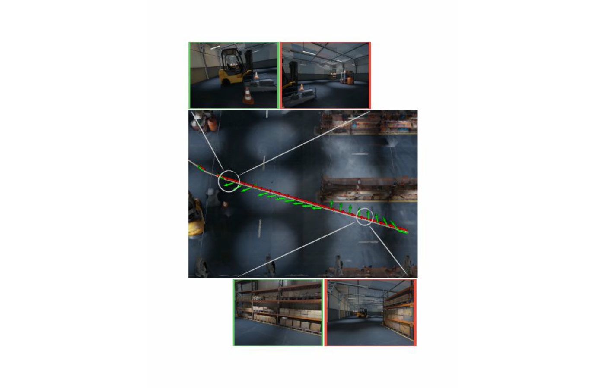
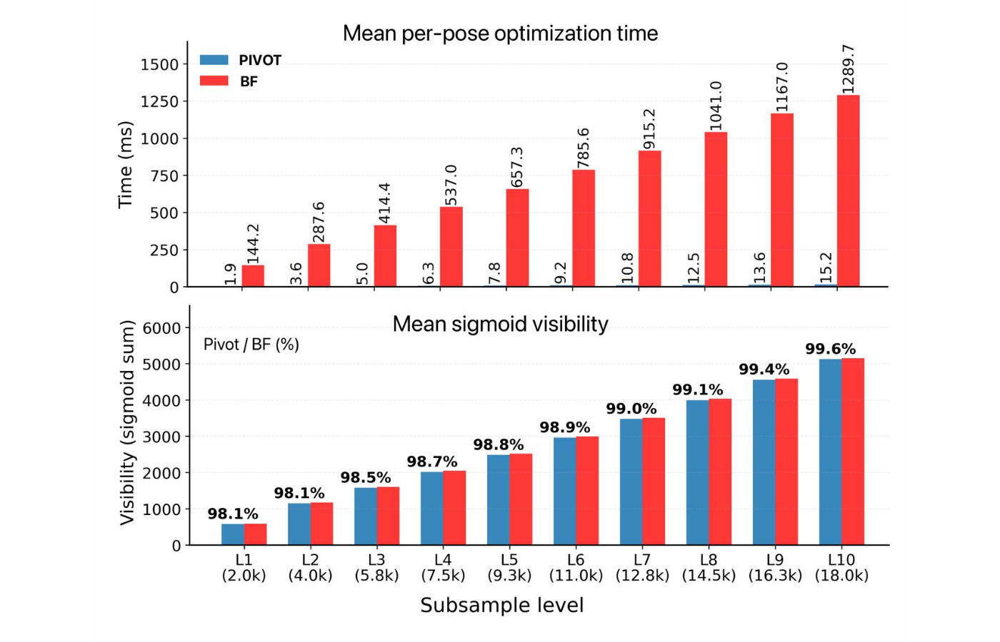
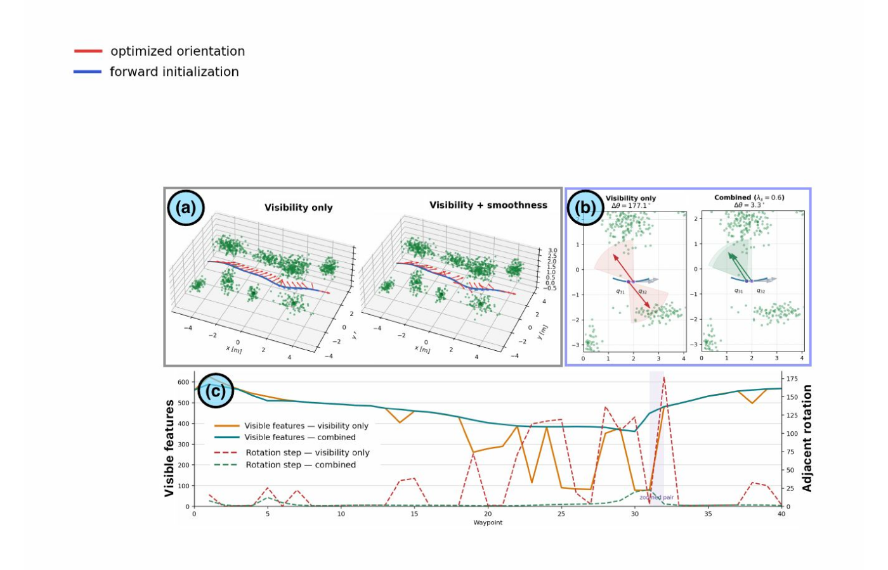
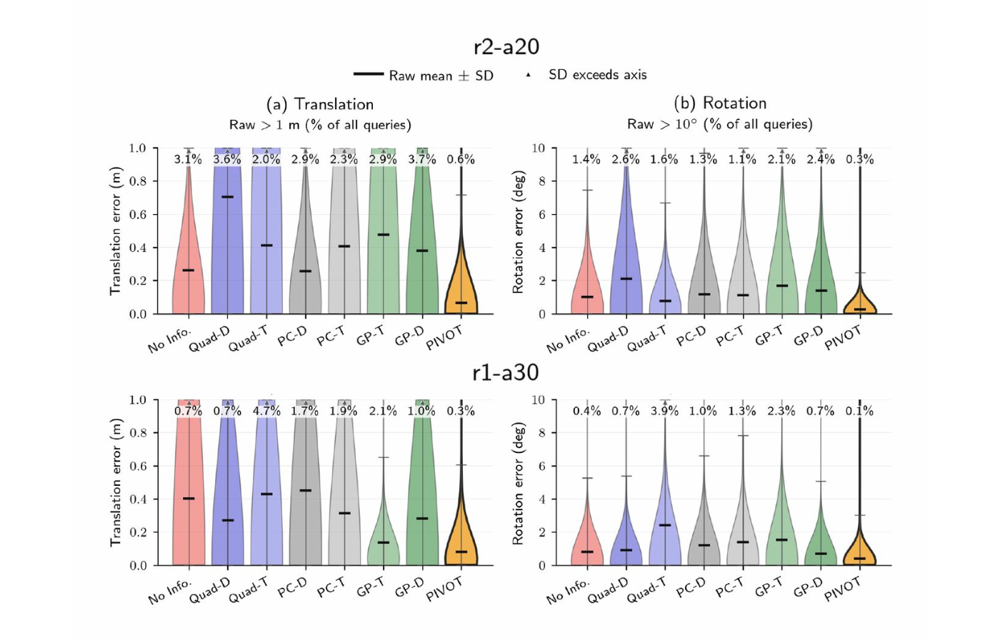
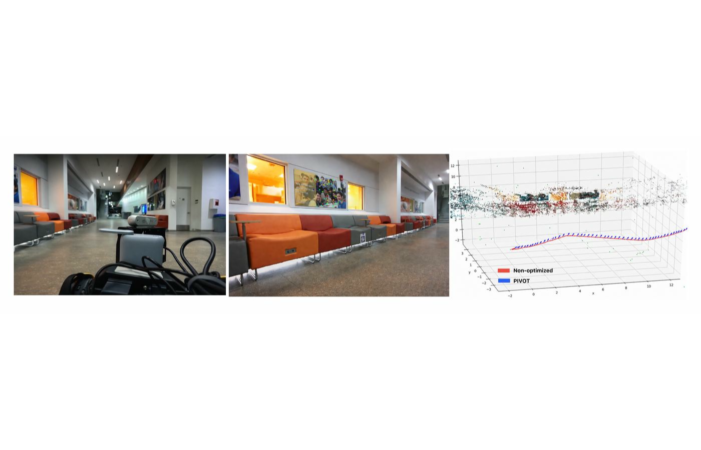

# PIVOT: Perception-aware Independent Viewpoint Online Optimization

[](https://droneslab.github.io/PIVOT/)
[](https://arxiv.org/abs/2609.19510)
[](https://youtu.be/IWPBh4lygTE)

[**Yuyang Chen\***](https://droneslab.github.io/people/yuyang/), [**Shekoufeh Sadeghi\***](https://scholar.google.com/citations?user=NCCK7doAAAAJ&hl=en), [Charuvahan Adhivarahan](https://charuvahan.com/), Elton Lemos, Chen Wang, Sanjeev J. Koppal, and [Karthik Dantu](https://dkkarthik.github.io/)  
\*Equal contribution  
*Preprint. Submitted to IEEE Robotics and Automation Letters (RA-L).*

PIVOT is a lightweight online method for controlling the viewing direction of **motion-decoupled sensors** such as gimbal-mounted cameras and steerable depth sensors. Given a fixed translation trajectory and a 3D landmark map, PIVOT optimizes only the sensor orientation so that task-relevant features remain inside the limited field of view.

Under a conical FoV model, visibility depends only on the optical axis, giving a two-DoF optimization on the viewing sphere **S²**. PIVOT uses a differentiable visibility objective and coordinate-free **SO(3) exponential-map updates** to avoid explicit angular parameterizations and exhaustive viewing-sphere search. A trajectory-level smoothness term encourages continuous sensor pointing and temporal view overlap.

<p align="center">
  
</p>

## Highlights

- **Online viewpoint optimization:** sensor pointing is optimized independently of robot translation.
- **On-manifold updates:** continuous SO(3) exponential-map updates avoid yaw/pitch singularities and discrete candidate-view search.
- **Smooth trajectories:** a neighboring-view objective suppresses abrupt camera rotations while preserving feature visibility.
- **Fast visibility optimization:** across ~2k-18k landmarks, PIVOT retains **98.1-99.6%** of brute-force visibility with a **76-85× speedup**.
- **Photorealistic localization:** PIVOT obtains the lowest localization errors and registration-failure rates among the evaluated methods while using far less total computation.
- **Real robot validation:** on the evaluated Spot hallway route, PIVOT registers **416/420 frames (99.0%)**, versus **296/420 (70.5%)** with a forward-facing camera.

## Method

<p align="center">
  
</p>

At each trajectory waypoint, PIVOT maximizes a smooth feature-visibility objective. For trajectory optimization, the objective combines feature visibility with alignment between neighboring optical axes:

> **maximize:** visibility + λ × viewpoint smoothness  
> **optimize:** sensor orientation only  
> **fixed:** robot translation trajectory

The optimizer operates directly on the current landmark set and does not require a separately precomputed perception-quality field.

## Main Results

### Visibility vs. brute force

<p align="center">
  
</p>

| Metric | PIVOT result |
|---|---:|
| Retained brute-force visibility | **98.1-99.6%** |
| Speedup over 2° brute force | **76-85×** |
| Mean per-pose runtime | **1.9-15.2 ms** |
| Brute-force runtime | 144.2-1289.7 ms |

### Trajectory smoothness

<p align="center">
  
</p>

With the combined visibility + smoothness objective, the highlighted adjacent-view change is reduced from **177.1° to 3.3°** while largely preserving the visibility profile.

### Visual localization

<p align="center">
  
</p>

| Map | PIVOT registration failure | Next-best evaluated baseline | PIVOT total compute |
|---|---:|---:|---:|
| r1-a30 | **29.6%** | 41.0% | **0.045 s** |
| r2-a20 | **2.4%** | 4.4% | **0.061 s** |

### Real-world Spot experiment

<p align="center">
  
</p>

PIVOT is evaluated on a Boston Dynamics Spot with a pan-tilt gimbal and Intel RealSense D455. On the indoor Autowalk experiment, PIVOT achieves **99.0% COLMAP registration success (416/420)** compared with **70.5% (296/420)** for the forward-facing condition.

## Baseline Code

The Fisher Information Field (FIF) comparison code used for the baseline experiments is maintained separately so that the upstream baseline lineage remains clear:

- **FIF baseline fork:** https://github.com/cikufa/my_FIF-perception-aware-planning

The paper compares PIVOT with PC-D, PC-T, GP-D, GP-T, Quad-D, and Quad-T in the photorealistic visual-localization evaluation.

## Repository Layout

The repository currently contains the core C++ optimizer, Monte Carlo evaluation scripts, trajectory-level optimization, visual-localization evaluation, mapping / registration utilities, and robot-side integration code. The main implementation is under `Manifold_cpp/`; experiment automation is under `scripts/`.

## Reproducing the Experiments

A cleaned, end-to-end reproduction guide is being prepared. The current repository already contains experiment scripts and developer notes, including `IMPLEMENTATION_SUMMARY.md` and `ESDF_INTEGRATION_GUIDE.md`.

To make this section fully reproducible, we still need to document the exact environment and artifact locations listed in **Implementation details needed** below.

### Clone

```bash
git clone https://github.com/droneslab/PIVOT.git
cd PIVOT
```

### Build the core optimizer

```bash
cd Manifold_cpp
mkdir -p build && cd build
cmake ..
make -j
```

> **TODO:** dependency versions and the exact recommended build configuration will be added once confirmed.

### Monte Carlo evaluation

The repository provides:

- `scripts/generate_cluster_map.py` for clustered synthetic maps and nested feature subsets.
- `scripts/run_monte_carlo_experiment.py` for PIVOT / brute-force evaluation.
- `scripts/plot_monte_carlo_results.py` for the runtime, visibility, and spatial comparison plots.

Example:

```bash
python scripts/generate_cluster_map.py \
  --name clusters_demo \
  --clusters 9 \
  --features-per-cluster 2000 \
  --bounds -400 400 -400 400 0 20 \
  --pose-resolution 20,20,1 \
  --seed 42 \
  --subsample-levels 10

python scripts/run_monte_carlo_experiment.py \
  --map-name clusters_demo \
  --all-levels \
  --build
```

> **TODO:** confirm the exact command used for the paper's 9-cluster / 2k-18k evaluation so this example matches the released result exactly.

## Implementation details needed

Please provide/confirm the following so we can finish the public reproduction instructions without guessing:

1. **Supported OS and compiler:** exact Ubuntu version, GCC/CMake versions used for the released code.
2. **C++ dependencies:** required versions/install commands for Eigen, voxblox / minkindr, protobuf, and any other non-system dependencies.
3. **Python environment:** Python version and packages required by the map-generation, plotting, COLMAP, and evaluation scripts (ideally `requirements.txt` or conda YAML).
4. **COLMAP stack:** COLMAP version plus the exact `colmap_utils` commit/version and any local patches.
5. **Simulation stack:** exact NVIDIA Isaac / Unreal Engine / UnrealCV versions and where the warehouse scene/assets can be obtained.
6. **FIF baseline:** exact commit and commands/configs used in [`cikufa/my_FIF-perception-aware-planning`](https://github.com/cikufa/my_FIF-perception-aware-planning) for PC-D, PC-T, GP-D, GP-T, Quad-D, and Quad-T.
7. **Paper experiment configs:** released config/command for Monte Carlo, trajectory smoothness, `r1-a30`, and `r2-a20` experiments.
8. **Real robot stack:** ROS version, Spot software dependencies, FAST-LIO repo/commit, gimbal driver/controller repo, and topic names expected by the scripts.
9. **Maps / datasets / bags:** which artifacts can be released publicly and their download locations; otherwise we will mark them as coming soon.
10. **License:** desired code license for this repository.

## Citation

```bibtex
@misc{chen2026pivot,
  title         = {PIVOT: Perception-aware Independent Viewpoint Online Optimization},
  author        = {Yuyang Chen and Shekoufeh Sadeghi and Charuvahan Adhivarahan and Elton Lemos and Chen Wang and Sanjeev J. Koppal and Karthik Dantu},
  year          = {2026},
  eprint        = {2609.19510},
  archivePrefix = {arXiv},
  primaryClass  = {cs.RO}
}
```

## Links

- **Project page:** https://droneslab.github.io/PIVOT/
- **Paper:** https://arxiv.org/abs/2609.19510
- **Code:** https://github.com/droneslab/PIVOT
- **Video:** https://youtu.be/IWPBh4lygTE
- **FIF baseline code:** https://github.com/cikufa/my_FIF-perception-aware-planning
